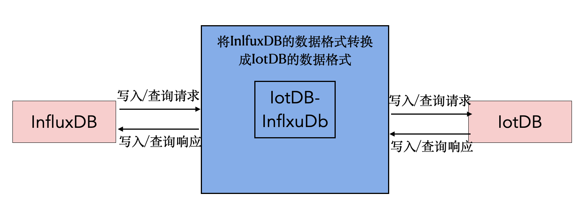
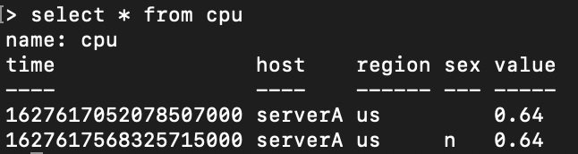
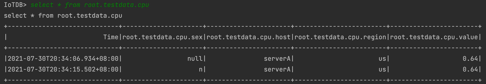
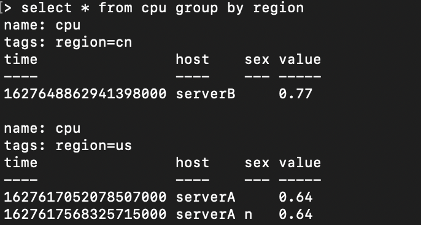
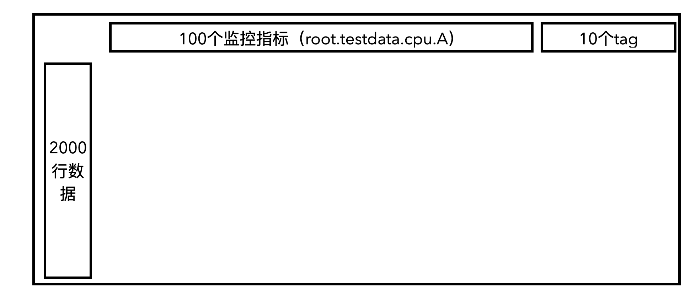
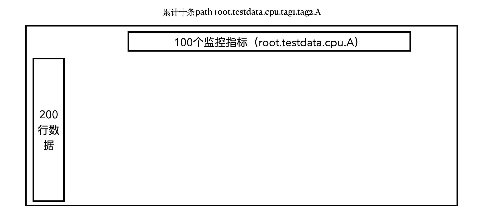
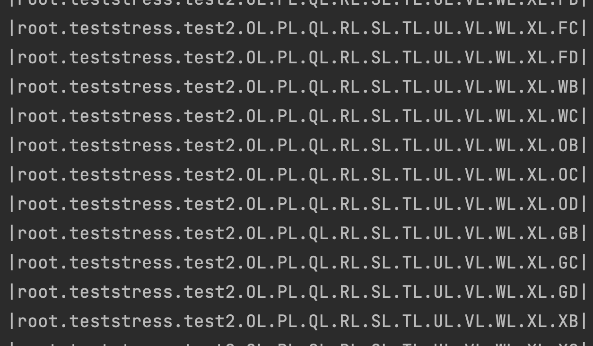

 # IotDB-InfluxDB适配器


## 1.背景

InfluxDB是当前世界排名第一的时序数据库，具有繁荣的生态系统，目前很多用户使用它来作为自己的第一选择。但是，实际上线后，会有高可用，高扩展的需求。如果换成别的数据库，会有比较高的迁移成本。

## 2.目标 

开发一套Java版本的适配器可以使IotDB兼容InfluxDB协议，完善IotDB的功能。

1. IotDB-InfluxDB：支持InfluxDB写入；支持InfluxDB部分查询；支持完整的InfluxDB查询。
2. 对正确性和性能的测试，不仅要适配InfluxDB，也要知道在繁重的负载下是否可以很好的工作，例如：以非常高的频率生成数据
   1. 正确性测试：通过适配器以influxb的协议插入数据，然后查询IotDB数据库，将我们认为发送的内容与我们希望存储的内容进行比较。进行正确性测试
   2. 性能测试：以多线程的方式或者以Fiber多协程方式并发写入和读取，进行性能测试，类似的 demo：https://github.com/Tencent/TencentKona-8/tree/KonaFiber/demo/fiber/iotdb-sync-stress-demo

## 3.方案一

### 3.1 IotDB-InfluxDb适配器

适配器是一个继承至InfluxDB基类的子类，实现了InfluxDB主要的写入和查询方法，用户通过改变代码中InfluxDB的实现类，从而使InfluxDB原有的操作函数没有改变，但是会以IotDB的协议写入IotDB数据库中。



### 3.2 将InfluxDB的数据格式转换成IotDB的数据格式

#### 3.2.1问题

1. 问题：InfluxDB中Tag的顺序不敏感，而在IoTDB中是敏感的。

   a. InfluxDB的时序构成

   ​	i. measurement

   ​	ii.tag key tag value

   ​	iii. field key field value

   b. IotDB的时序构成

   ​	i. storage group

   ​	ii. path(time series ID)

   ​	iii. measurement

2. 关键点：需要记录每个tag对应的顺序，确保InfluxDB中label顺序不同的同一条时序对应到IoTDB中也是一条时序
3. 需要解决的事情
   1. 怎样映射tag key和它对应的order
   2. 在不知道所有的label key的情况下，怎么维护他们之间的顺序

### 3.2.2解决方案

##### 3.2.2.1主要思想

1. 内存中Map <Database_Measurement, Map <Tag Key, Order> > table结构维护Tag之间的顺序
2. InfluxDB中时序根据label顺序对应到IoTDB

##### 3.2.2.2实例

a. 添加时序

   1.  InfluxDB时序(database=testdabase)：

      (1)student{name=A,phone=B,sex=C}

      (2)student{address=D}

      (3))student{name=A,phone=B,sex=C,address=D} 

   2. 简单对上述InfluxDB的时序进行解释，database是testdatabase；measurement是student；tag分别是name，phone、sex和address

   3.  (1)对应的记录tag顺序的table为

      ​	

      | database_measurement | tag_key | order |
      | -------------------- | ------- | ----- |
      | testdatabase_student | name    | 0     |
      | testdatabase_student | phone   | 1     |
      | testdatabase_student | sex     | 2     |

      (2)对应的记录tag顺序的table为

      ​	

      | database_measurement | tag_key | order |
      | -------------------- | ------- | ----- |
      | testdatabase_student | name    | 0     |
      | testdatabase_student | phone   | 1     |
      | testdatabase_student | sex     | 2     |
      | testdatabase_student | address | 3     |

      (3)对应的记录tag顺序的table为

      ​	

      | database_measurement | tag_key | order |
      | -------------------- | ------- | ----- |
      | testdatabase_student | name    | 0     |
      | testdatabase_student | phone   | 1     |
      | testdatabase_student | sex     | 2     |
      | testdatabase_student | address | 3     |

4. (1)对应IotDB时序为root._testdatabase_student.A.B.C

   (2)对应IotDB时序为root._testdatabase_student.ph.ph.ph.D(其中ph表示占位符)

   (3)对应IotDB时序为root._testdatabase_student.A.B.C.D

5. 为了重启时候对table的恢复，在IoTDB中记录数据

   | `root.TAG_INFO.measurement_name` | `root.TAG_INFO.tag_name` | `root.TAG_INFO.tag_order` |
   | :------------------------------- | :----------------------- | :------------------------ |
   | testdatabase_student             | name                     | 0                         |
   | testdatabase_student             | phone                    | 1                         |
   | testdatabase_student             | sex                      | 2                         |
   | testdatabase_student             | address                  | 3                         |

b. 查询数据

	1. 查询student中phone=B的数据。在testdatabase_student中phone的顺序为1，order最大值是3，对应到IotDB的查询为：select * from root.testdatabase_student.*.B
 	2. 查询student中phone=B且存储的socre>97的数据，对应到IotDB的查询为：select * from root.testdatabase_student.*.B where socre>98
 	3. 查询student中phone=B且存储的socre>97且时间在最近七天内的的数据，对应到IotDB的查询为：select * from root.testdatabase_student.*.B where socre>98 and time > now()-7d

## 4.方案二

### 4.1关系映射

#### 4.11influxdb：

1. database
2. measurement
3. tag key tag value.  field key field value

#### 4.1.2iotdb

1. storage group
2. device
3. timeseries

我们将上面对应的三点一一对应，举例如下

### 4.2举例

#### 4.2.1写入

inlfuxbd的写入语句分别为（默认database=testdata）

1. insert cpu,host=serverA,region=us value=0.64（tag为host、region）
2. insert cpu,host=serverA,region=us,sex=n value=0.64（tag为host、region、sex）

最终写入情况为：



iotdb的写入数据为

1. insert into root.testdata.cpu(timestamp,host,region,value) values(now(),"serverA","us",0.64)
2. insert into root.testdata.cpu(timestamp,host,region,sex,value) values(now(),"serverA","us","n",0.64)

最终写入情况为：



我们可以发现，二者实际存储对表面形式也比较类似。

#### 4.2.2查询

当把influxdb的tag和field都当作timeseries写入数据中时，由于存储的表面形式比较类似，最终查询就比较方便了。

1. 根据值查询

   select * from root.testdata.cpu where value = 0.64

2. 根据tag查询

   select * from. root.testdata.cpu where region = "us"

3. 根据time查询

   select * from root.testdata.cpu where time>now()-7d

4. 混合查询

   由于把tag和filed都当作timeseries查询，混合查询也同理。

5. group by

   influxdb中group by可以按照tag分组展示

   

   inflxudb中的group by功能不太类似，因此实现方法是：先获取所有的数据，然后在列表中以hash的方式手动分组，理论上复杂度为O（n），复杂度可以接受。

## 5.方案对比-性能测试

### 5.1存储情况

1. influxdb的tag和filed均当作iotdb的timeseries



2. influxdb的tag当作路径



### 5.2查询情况

1. 查找条件为select * from root.teststress.test1 where RL = 1 and A = 1 and B =1 and C=1

   其中RL是tag，A，B，C均为field

2. 取中间值情况，即当有十个tag时，取中间第五个累积递增

   ```java
           SessionDataSet dataSet = session.executeQueryStatement("select * from root.teststress.test2.*.*.*.*.SL where A=1 and B=1 and C=1");
           dataSet = session.executeQueryStatement("select * from root.teststress.test2.*.*.*.*.SL.* where A=1 and B=1 and C=1");
           dataSet = session.executeQueryStatement("select * from root.teststress.test2.*.*.*.*.SL.*.*.* where A=1 and B=1 and C=1");
           dataSet = session.executeQueryStatement("select * from root.teststress.test2.*.*.*.*.SL.*.*.*.* where A=1 and B=1 and C=1");
           dataSet = session.executeQueryStatement("select * from root.teststress.test2.*.*.*.*.SL.*.*.*.*.* where A=1 and B=1 ");
   ```

### 5.3特殊说明

1. 为了存储的方便，第二种情况的存储，没有把tag的value存入路径中，即直接把tag的key存入路径中。其表现为

   前面累积的path都是相同的，这样最后会导致的结果是：会加快根据path过滤的查找，如：

   ```sql
   select * from root.teststress.test2.*.*.*.*.SL.*.*.*.*.*
   ```

   这时只有一条路径，所有速度会变快，即第二种查找的时间会比实际的快一些

### 5.4测试结果

第一种查找的时间平均可以达到40ms附近，第二种查找的时间在200ms附近

同时如果第二种查找的时候，在较靠前的路径使用*，(select * from root.teststress.test2.* where A=1 and B=1 )会导致需要查找的path过多，报错信息如下

```log
Too many paths in one query! Currently allowed max deduplicated path number is 715, this query contains 1000 deduplicated path. Please use slimit to choose what you real want or adjust max_deduplicated_path_num in iotdb-engine.properties.
```

综上所述，建议采取tag和field均当作timeseries的存储方法。

## 6.参考资料

1. https://summer.iscas.ac.cn/#/org/orgdetail/apacheiotdb
2. https://cwiki.apache.org/confluence/pages/viewpage.action?pageId=165224300#Prometheus%E8%BF%9E%E6%8E%A5%E5%99%A8-3.4%E5%8F%82%E8%80%83%E6%96%87%E6%A1%A3